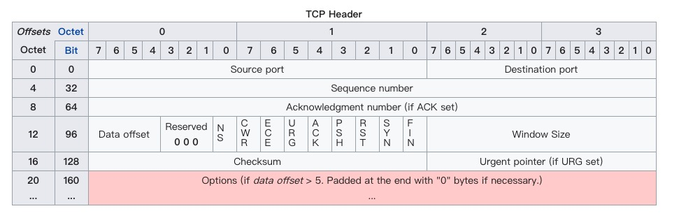
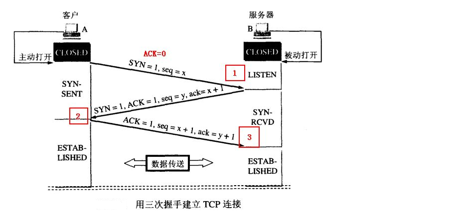
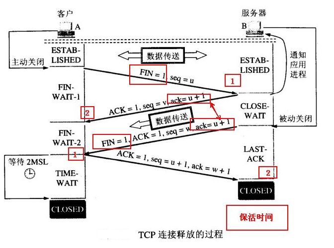

# TCP and UDP DETAILS

## TCP DETAILS
### TCP 协议简介

TCP （Transport Control Protocal, 传输控制协议） 工作在网络的 OSI 七层模型中的第四层，传输层，第四层的数据叫段（Segment）

### TCP 协议的报头

**16bit 源端口号/16bit 目的端口号**： 用于区别主机中的不同进程，而 IP 地址是用来区分不同主机的，源端口号和目的端口号加上 IP 首部中的源 IP 地址和目的 IP 地址就能唯一的确定一个 TCP 连接

**32bit 序号 Sequence Number**： 用来标识 发送端发送的数据字节流，主要用来解决网络包乱序的问题

**32bit 确认序号 Acknowledgment Number**： 表示接收方期望收到发送方下一个报文段的第一个字节数据的编号

**4bit 首部 + 保留 6bit + 6bit 标志位 Flags + 16bit 窗口 Window size**
- **首部 Offset**： 任选字段的长度，最多能表示 15 个 32bit的字，即4*15=60个字节的首部长度， 因此TCP最多有 60 字节的首部，当没有任选字段时，正常长度是 20 字节

- **标志位 Flags**： 六个标识位，多个可以同时被设置为 1，主要用来操控 TCP 状态机

|FLAGS | MEANING|
|:----:|:---|
|URG|表示 TCP 包的紧急指针域有效，用来保证 TCP 连接不被中断，并且监督中间层设备要尽快处理这些数据|
|**ACK**|为 1 时表示应答域（Acknowledge Number）有效|
|PSH|表示 Push 操作，也就是在数据包到达接收端之后，立即传送给应用程序，而不是在缓冲区中排队|
|RST|表示连接复位请求，用来复位那些产生错误的连接，也被用来拒绝错误和非法的数据包|
|**SYN**|表示同步序号，用来建立连接。SYN 和 ACK标识搭配使用，当第一次请求连接时 SYN = 1， ACK = 0， 当连接被响应时 SYN = 1， ACK = 1|
|**FIN**|表示发送端已经达到数据末尾，双方的数据传送完成。 发送 FIN 标识为的 TCP 数据包之后，连接即将被断开|

- **窗口 Window**：窗口大小，也就是滑动窗口，用来进行流量控制

### TCP 连接管理

#### 1. TCP 三次握手

整个流程：

1. 客户端主动打开，发送连接请求报文段，其中 SYN=1, Sequence = x, 然后进入 **SYN_SEND** 状态

2. 服务器收到 SYN 报文段后，给客户端发送确认，其中 SYN=1， Sequence=y, ACK=1, Acknowledgment number = x+1, 然后进入 **SYN_RECV** 的状态，这个状态被称为半连接状态

3. 客户端收到服务器的返回后再次想服务器发送报文， 其中 ACK=1，Sequence = x+1， Acknowledgment number = y+1，此时客户端进入 **ESTABLISHED**。 服务端收到这个回复的报文后，也进入 **ESTABLISHED** 状态。

至此，三次握手过程就完成了。

**Q1.** 为什么是三次握手，为什么不是两次握手？或者四次握手？

A1. 主要是为了防止已经失效的连接请求报文（在某些网络节点长时间滞留）又传回到服务器而产生无效的连接（因为此时客户端并没有连接请求，但是服务端以为客户端有连接请求，服务器会一直等待不存在的客户端给它发数据，会造成服务器的资源良妃）

**Q2.** 什么是 SYN 攻击？

A2. 在三次握手过程中，当 Server 发送 SYN、ACK 之后，收到 Client 的 ACK 之前的连接状态称作半连接状态（half-open connect），也就是 SYN_RCVD 状态。 SYN 攻击就是 Client 在短时间内伪造大量不存在的 IP 地址，并且不断向 Server 发送请求连接，Server 回复并等待 Client 确认。由于源地址不存在，因此 Server 会不断的重发直至超时，这些伪造的 SYN 包会长时间占用未连接队列，导致正常的 SYN 请求应为队列满而被丢弃，从而引起网络堵塞甚至系统瘫痪。

SYN 攻击是典型的 **DDOS** 攻击，检测 SYN 攻击的方式很简单，当 Server 上有大量半连接状态且源 IP 地址是随机的就可以断定遭受到了 SYN 攻击，可以用下面的命令

    $netstat -na | grep SYN_RECV

#### 2. TCP 四次挥手

TCP四次挥手是 TCP 连接释放的过程，流程图如下

当 Client 的数据发送完毕，之后再也没有数据发送之后，就需要释放连接，整个过程如下：

1. Client 发送一个没有数据的报文给Server，其中 FIN=1， Sequence = u， 并且 Client 进入 **FIN_WAIT_1** 状态

2. Server 接收到断开连接的请求后，自己有可能还有数据没有传完，因此先发送一个回复报文给 Client， 其中 ACK = 1， Sequence = v， Acknowledgement number = u+1， 并且进入 **CLOSE_WAIT** 状态， 此时收到这次回复的 Client 进入 **FIN_WAIT_2** 状态

3. 当 Server 的数据传输完毕之后，再向 Client 回复一个断开连接请求，其中 FIN=1，ACK=1， Sequence = w， Acknowledgement number = u+1，并且进入 **LAST_ACK** 状态，至此 Client 和 Server 之间不再有数据传输

4. 当 Client 收到 FIN 的报文后，进入 **TIME_WAIT** 状态，然后返回一个报文给 Server， 其中 Acknowledgement number = w+1， Sequence = u+1。此时，Client 在 **TIME_WAIT** 状态等待 2**MSL** 之后进入 **CLOSED** 状态，Server 则在收到 Client 此次回复之后进入 **CLOSED** 状态。

至此，Client 和 Server 之前经历四次挥手成功断开连接。

**Q1.** 为什么 TIME_WAIT 状态要经过 2MSL（最大报文段生存时间）才能返回到 CLOSED 状态？

A1. 因为网络是不可靠的，有可能最后一个 ACK 会丢失，所以 TIME_WAIT 状态就是用来重发可能丢失的 ACK 报文。如果在等待的 2MSL 内又从 Server 收到了 FIN，那么 Client 会重发 ACK 并再次等待 2MSL。

2MSL 是指 2 倍的 MSL（Maximum Segment Lifetime）, 指一个片段在网络中最大的存活时间。 2MSL 就是一个发送和回复所需的最大时间。如果在 2MSL 期间 Client 没有再次收到 FIN， 那么Client就认为 ACK 已经被成功接收，并结束TCP连接。
