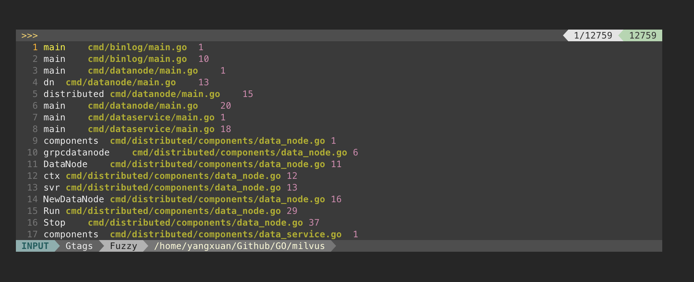

# VIM intro

This article: 

- Assumes you already have some vim experience
- Won't be step-by-step tutorial
- Will explain what is happening when you edit `~/.vimrc`

## Why VIM？

1. Better understanding of project structures
2. Better understanding of everything
3. Lightweight
4. Multi-language support
5. Addictive
6. All open-source(except some great but awful plugins)
7. Show off

## Why Not VIM?

1. Learning curve is steep.
   1. Lots of shortcuts to remember
   2. Lots of plug-ins to learn.
   3. If you don't know it thoroughly, you'll make a mess of yourself.
3. Need to keep up with the latest, newest, better maintained plug-ins. (Well, like all open source projects.)
4. Very customize, nearly impossible to migrate to other person's configuration.
4. Rely deeply on IDE or mouse.

## How to begin and where is the end？

#### Outside of VIM

#### 1. Download vim 8.1 or greater

```shell
$ vim --version | grep Vi
```

Vim >= 8.2 is recommended

And it's recommended to have vim with `+python3` and `+clipboard`

```shell
$ vim --version | grep python
$ vim --version | grep clipboard
```

#### 2. Good Terminal is everything beyond vim

Vim is a text editor, it's very hard to accomplish many things, such as visualization, step debug, auto build & run etc.

So we have to combine Terminal with vim to do such things. **A good terminal is everything in scenarios beyond vim**.

To me, a usable terminal **must** be able to accomplish these features:

1. Split panel.
2. **Search history commands and lists top-k results.**
3. **Green when commands are correct.**
4. Show working directory and do-not show user info.
5. Show python virtual-environment
6. **Show current working git branch and status briefly.**


Luckily, for Ubuntu these could be accomplished by `Terminator + ZSH + On-My-Zsh`.

For MacOS these could be accomplished by `iTerm2 + ZSH + On-My-Zsh` (Sadly iTerm2 will flush white line when full screen in Big Sur. According to iTerm2's issue, its Apple's bug and won't be fixed shortly. I've tried a-lot but nothing've changed, it's driving me crazy :(

For Windows, I don't know.

Status can be done by [powerlevel10k](https://github.com/romkatv/powerlevel10k)(or `powerline` with `powerline fonts`). And the following 3 plugins will do the rest, git is a default and the last 2 are available on GitHub:

```zsh
# in ~/.zshrc
plugins=(
 	git
  zsh-syntax-highlighting
  history-search-multi-word
)
```


#### Into VIM

#### 1.  L0 Never used vim before.

You can go through vim official `quickref` or 30-minute `tutor`(recommended),  then you are able to call yourself a newbie of vim.

```vim
" in vim buffer
:h quickref
```

```shell
$ vimtutor
```


#### 2. L1 Know the basic operation of vim.

Operation like `navigation`, `edit`, `save`, `visual`, `yank`, `paste` etc. 

Its time to understand text-object. Usually in this level, you are addicted to vim.

Inner-word -> iw

Around-word -> aw

> Note: get rid of up, down, left, right, and you will find yourself learning vim much faster.

#### 3. L2 Use existed `.vimrc` but don't understand why.

From my point of view, it's a good start of  setting your own `.vimrc`, but if you stop in this level, it's no difference as using VSCode(Something sometimes works, but don't know why and don't know how to optimize.).

#### 4. L3 Choose Your own vim plugins and change short-cuts as your own wish.

Recommended.

#### 5. L4 Write your own vim plugins or contribute to vim-plugin projects.

#### 6. L5 Contribute to vim.

## Plugins

#### 1. Before setting up, ask yourself what's a must and what's optional.

For QingXiang, the following feature is all he need to develop golang, python, and cpp:

- Vim common settings
- Go To Definition or Declaration
- Fuzzy Nivagate files by filename
- Auto Completion
- Directory structure tree
- Code check and auto fix
- Status line
- Code highlighting
- Other things: terminal

For me:

- Vim common settings
- Go to definition, usage, declaration, implementation
- Go to grep result, filename, recent files
- Auto completion, lint, fix
- Git status
- Markdown and rst real time preview
- Status line
- Code highlighting
- Fold code
- Quick comment

#### 2. Vim common settings

```vim
" Don't act like vi
set nocompatible

" Center view on the search result
noremap n nzz
noremap N Nzz

" Resize buffer
noremap <Leader>= :res +10<CR>
noremap <Leader>- :res -10<CR>
noremap <Leader>, :vertical resize -10<CR>
noremap <Leader>. :vertical resize +10<CR>

" replace auto-pair, it's too agressive
inoremap (<CR> (<CR>)<C-c>O
inoremap {<CR> {<CR>}<C-c>O
inoremap [<CR> [<CR>]<C-c>O
inoremap {; {<CR>};<C-c>O
inoremap () ()<C-c>i
inoremap {} {}<C-c>i
inoremap [] []<C-c>i

inoremap < <><C-c>i
inoremap " ""<C-c>i

" highlight search
set hlsearch
noremap <F8> :nohl<CR>
inoremap <F8> :nohl<CR>a

set ignorecase
set smartcase

" important
set backspace=2
filetype plugin indent on

syntax on
set nu
set updatetime=100

set expandtab
set tabstop=4
set shiftwidth=4

" enable fold
set foldenable
set foldmethod=indent
set foldlevel=99

" set encoding
set colorcolumn=110
highlight ColorColumn ctermbg=darkgray
set encoding=utf-8
set termencoding=utf-8
set fileencoding=utf-8

"press F9 to fold/unfold code
nnoremap <F9> za
vnoremap <F9> zf

" split navigation
nnoremap <C-J> <C-W><C-J>
nnoremap <C-K> <C-W><C-K>
nnoremap <C-L> <C-W><C-L>
nnoremap <C-H> <C-W><C-H>

" Only if vim is install with +clipboard
noremap <Leader>y "*y
noremap <Leader>p "*p
noremap <Leader>Y "+y
noremap <Leader>P "+p

"search select
vnoremap // y/\V<C-R>=escape(@",'/\')<CR><CR>
nnoremap // yiw/\V<C-R>=escape(@",'/\')<CR><CR>
```

#### 3. Plug manager `vim-plug`

[vim-plug](https://github.com/junegunn/vim-plug) **fast, parellel**

After installing vim-plug,  you can manage you plugins in `.vimrc`. All projects from GitHub can be plugins.

```vim
" in .vimrc
call plug#begin('~/.vim/plugged')
Plug 'username-of-github/projectname-of-github'
...
call plug#end()
```

- `:PlugInstall` clone the plugin projects down.
- `:PlugClean` remove not using plugins
- `:PlugUpdate` update plugins

#### 4. Key plugins -- these are all you need

My principle to choose plugins:

- General, multi-language
- Well-maintained, keep up with the newest vim
- Async
- Well-documented
- Open-source (Off course!)

|Plugin|function|
|---|---|
|[YouCompleteMe](https://github.com/ycm-core/YouCompleteMe)|**Multi-language** go to definition/declaration, auto completion|
|[ale](https://github.com/dense-analysis/ale)|**Multi-language** code linter and fixer|
|[LeaderF](https://github.com/Yggdroot/LeaderF) + [gtags](https://www.gnu.org/software/global/) + [ripgrep](https://github.com/BurntSushi/ripgrep)|**Multi-language** fuzzy file navigation, find/goto usage, find/goto grep result|
|[gruvbox](https://github.com/morhetz/gruvbox)|code highlighting|

#### 4.1. But I need more...
|Plugin|function|
|---|---|
|[nerdtree](https://github.com/preservim/nerdtree)|project directory structure|
|[vim-airline](https://github.com/vim-airline/vim-airline)|status line with thousands of themes|
|[vim-gitgutter](https://github.com/airblade/vim-gitgutter)|real time git status|
|[auto-pairs](https://github.com/jiangmiao/auto-pairs)|Auto pairs|

#### 4.2. But I love vim-go...

[vim-go](https://github.com/fatih/vim-go), GLWT

## About `LeaderF` and `YouCompleteMe`

#### 1. YouCompleteMe

Very difficult to compile, once it's compiled successfully,  it will take your develop experience of vim to the next level.

And a little bit more effort to use of CPP, see the [official doc](https://github.com/ycm-core/YouCompleteMe)

```vim
" YouCompleteMe
let g:ycm_autoclose_preview_window_after_completion=1
let g:ycm_min_num_identifier_candidate_chars = 2
let g:ycm_add_preview_to_completeopt = 0
let g:ycm_show_diagnostics_ui = 0
let g:ycm_server_log_level = 'info'
let g:ycm_collect_identifiers_from_comments_and_strings = 1
let g:ycm_complete_in_strings = 1
let g:ycm_global_ycm_extra_conf = '~/.ycm_extra_conf.py'
let g:ycm_semantic_triggers =  {
            \ 'c,cpp,python,java,go,erlang,perl': ['re!\w{2}'],
            \ 'cs,lua,javascript': ['re!\w{2}'],
            \ }
let g:ycm_filetype_whitelist = {
            \ "c":1,
            \ "cpp":1,
            \ "objc":1,
            \ "go":1,
            \ "python":1,
            \ "sh":1,
            \ "zsh":1,
            \ "cmake":1,
            \ "md":1,
            \ "vim":1,
            \ }
map <leader>g  :YcmCompleter GoToDefinitionElseDeclaration<CR>
```

#### 2. LeaderF + [gtags](https://www.gnu.org/software/global/global.html) 

[LeaderF+gtags](https://zhuanlan.zhihu.com/p/64842373) , gtags is also called GNU-global, originally supports 6 languages (C, C++, Yacc, Java, PHP4 and assembly.)

**Why LeaderF + gtags?**

- Why gtags?  Ref to this [comparison](https://github.com/oracle/opengrok/wiki/Comparison-with-Similar-Tools)

- LeaderF  can generate and manage gtags automatically, you only need to worry about `gtags.conf`

- LeaderF can handle tag lists and jump to tags.

  

#### 2.1 Download gtags>=6.6.3

[download link](https://www.gnu.org/software/global/download.html)

Briefly, Ubuntu will have to build by ourselves, MacOS can install via `brew install global`

#### 2.2 cp /usr/local/share/gtags/gtags.conf ~/.globalrc

```shell
man gtags.conf
```

Using this to check `global`'s config file searching order.

```shell
GTAGS.CONF(5)                                                               File Formats Manual                                                               GTAGS.CONF(5)

NAME
       gtags.conf - configuration data for GNU GLOBAL

SYNOPSIS
       ´gtags.conf´
       ´~/.globalrc´

DESCRIPTION
       ´gtags.conf´  has  configuration data for global(1), gozilla(1), gtags(1) and htags(1). They look for the following files in this order, and read from the first one
       that exists and is readable.

       (1) --gtagsconf file

       (2) $GTAGSCONF

       (3) [project root]/gtags.conf

       (4) [project root]/[objdir]/gtags.conf

       (5) $HOME/.globalrc

       (6) /etc/gtags.conf

       (7) [sysconfdir]/gtags.conf
```

#### 2.3 Install pygments to support 300+ languages

- Make sure your symlink **`python`** is pointed to **`python3`**, alias won't work.
- `python -m pip install pygments`
- Test installation

```shell
$ export GTAGSLABEL = 'pygments'

# It's recommended to do this in a small directory,
#   because gtags will tag current directory recursively,
#   and we don't want to tag our $HOME
$ gtags -v
$ global -c
```

#### 2.4 How do these affect vim?

First, add LeaderF plugin and `:PlugInstall`

```vim
Plug 'Yggdroot/LeaderF', {'do': ':LeaderfInstallCExtension'}
```

Then tune a little bit, ref [LeaderF](https://github.com/Yggdroot/LeaderF)

```vim
" leaderf
" cache in $HOME/.LfCache/gtags
let g:Lf_GtagsAutoGenerate = 1
" let g:Lf_Gtagsconf = '/usr/local/share/gtags/gtags.conf'
let g:Lf_Gtagslabel = 'native-pygments'
"reference
noremap <leader>fr :<C-U><C-R>=printf("Leaderf! gtags -r %s --auto-jump", expand("<cword>"))<CR><CR>
"definition
noremap <leader>fd :<C-U><C-R>=printf("Leaderf! gtags -d %s --auto-jump", expand("<cword>"))<CR><CR>
noremap <leader>fo :<C-U><C-R>=printf("Leaderf! gtags --recall %s", "")<CR><CR>
noremap <leader>fn :<C-U><C-R>=printf("Leaderf gtags --next %s", "")<CR><CR>
noremap <leader>fp :<C-U><C-R>=printf("Leaderf gtags --previous %s", "")<CR><CR>

let g:Lf_ShortcutF = '<c-p>'
noremap <c-n> :LeaderfMru<cr>
noremap <leader>ff :LeaderfFunction!<cr>
noremap <leader>fb :LeaderfBuffer<cr>
let g:Lf_StlSeparator = { 'left': "\ue0b0", 'right': "\ue0b2", 'font': "DejaVu Sans Mono for Powerline" }

let g:Lf_RootMarkers = ['.project', '.root', '.svn', '.git']
let g:Lf_WorkingDirectoryMode = 'Ac'
let g:Lf_WindowHeight = 0.30
let g:Lf_ShowRelativePath = 0
let g:Lf_HideHelp = 1
let g:Lf_PreviewResult = {'Function':0, 'BufTag':0}
let g:Lf_WindowPosition = 'popup'
let g:Lf_previewInPopup = 1
let g:Lf_ShowDevIcons = 0
```

#### 2.5 You are good to go.

Go into your project root and type vim

```shell
$ vim
```

Then you can check if tags are correctly generated by listing all tags,

```vim
:Leaderf gtags
```

If something like this popup, you are all good:




**Wait ... Why there are tags from CPP and third-party projects?**

This is where `gtags.conf` or `~/.globalrc` makes an effort. We can open the `~/.globalrc` and set what directories  to skip. Or we can set project scope configs by placing a `gtags.conf` in our project root.

The following is what I've set. If you are developing CPP, the skip settings may be different.

```txt
common:\     :skip=HTML/,HTML.pub/,tags,TAGS,ID,y.tab.c,y.tab.h,gtags.files,cscope.files,cscope.out,cscope.po.out,cscope.in.out,SCCS/,RCS/,CVS/,CVSROOT/,{arch}/,autom4te.cache/,*.or    ig,*.rej,*.bak,*~,#*#,*.swp,*.tmp,*_flymake.*,*_flymake,*.o,*.a,*.so,*.lo,*.zip,*.gz,*.bz2,*.xz,*.lzh,*.Z,*.tgz,*.min.js,*min.css,cmake_build/,cwrapper_build/,cwrapper_buil    d/,cwrapper_rocksdb_build/,githooks/,build/,scripts/,tools/,cwrapper/,internal/core/:
```

If you find that `LeaderF` tags wrong directories, you are always able to **remove the tags** and **update config files** and **re-tag**.

In vim

```vim
:Leaderf gtags --remove
```

```vim
:Leaderf gtags --update
```


#### 3. LeaderF + ripgrep

[LeaderF+ripgrep](https://zhuanlan.zhihu.com/p/54865001)

**Why ripgrep?** Ref to this [comparison](https://beyondgrep.com/feature-comparison/) and [benchmark](https://github.com/BurntSushi/ripgrep) and a small test. 

Even you don't use vim, it's  still recommended to replace good old grep with ripgrep.

**Why LeaderF + ripgrep?**  Fastest grep plus jump, who else?

**Tune LeaderF a little bit:**

```vim
" search visually selected text literally
xnoremap gf :<C-U><C-R>=printf("Leaderf! rg -F -e %s ", leaderf#Rg#visual())<CR>
noremap ge :Leaderf! rg -F -e
noremap go :<C-U>Leaderf! rg --recall<CR>
```

If you are very familiar with rg, you can input by hands.

